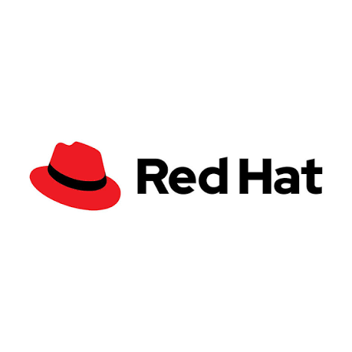

# RHA DAY 26 &mdash; Proctored Quiz Taker Portal
### Official Red Hat Academy Examination Platform for Gyan Ganga Institute of Technology & Sciences (GGITS)



A web-based, proctored examination application designed with an authentic **Red Hat Enterprise** visual theme (`#EE0000`, `#151515`, `#F0F0F0`, Google Fonts `Red Hat Display` and `Red Hat Text`) and institutional branding for **Gyan Ganga Institute of Technology & Sciences (GGITS), Jabalpur**.

Built for single timed certification sessions, the platform enforces client-side and server-side proctoring defenses, dynamic traceable watermarking, real-time violation telemetry, periodic webcam snapshots, and administrator auditing.

---

## 🎨 Branding & Red Hat Design System

- **Color Palette**:
  - **Primary Accent**: Red Hat Red (`#EE0000`)
  - **Hover / Active**: Deep Red (`#C00000` / `#990000`)
  - **Core Dark**: Jet Black (`#151515`) and Charcoal (`#0E0E0E`)
  - **Surfaces & Borders**: Crisp White (`#FFFFFF`), Soft Light Gray (`#F0F0F0`), Border Gray (`#D2D2D2`), Neutral Text (`#6A6E73`)
- **Typography**:
  - **Headings & Display**: `Red Hat Display` (Google Fonts, weights 600/700/900)
  - **Body & Forms**: `Red Hat Text` (Google Fonts, weights 400/500/700) with fallback to Inter/system-ui
- **Header Bar**:
  - Top-left: Red Hat logo (paw + wordmark) positioned as a "Powered by Red Hat Academy" badge.
  - Top-right: Gyan Ganga Institute of Technology & Sciences (GGITS) seal and wordmark.
  - Divider rule: Thin `#151515` border line directly beneath matching the GGITS logo's own black rule.
- **Buttons**:
  - Flat buttons with sharp/slightly rounded corners (`rounded-sm`), bold white text, smooth transition to deep red hover.
- **Footer**:
  - Jet Black (`#151515`) background, dual logos side by side, "RHA DAY 26" event title, and academic integrity statement.

---

## 🛡️ Anti-Cheating & Proctoring Defense Architecture

The application implements defense-in-depth measures against academic dishonesty:

| Defense Mechanism | Trigger / Scope | Action Taken |
| :--- | :--- | :--- |
| **Fullscreen Lock** | Quiz start | Forces native Fullscreen API. If user escapes or un-fullscreens, quiz immediately pauses, displays red-bordered warning modal, records `FULLSCREEN_EXIT` violation, and auto-submits upon reaching max strikes. |
| **Tab-Switch Detection** | `visibilitychange` (`hidden`) | Detects when student switches to another browser tab or minimizes browser. Logs millisecond timestamp and incident type `TAB_SWITCH`. |
| **Window Blur Tracking** | `window.onblur` | Detects when student clicks out to another window, dual monitor, or OS taskbar. Logs duration and `WINDOW_BLUR`. |
| **PrintScreen Shield** | `keyup` / `keydown` (`PrintScreen`) | Immediately blanks the entire screen with a high-contrast pitch-black overlay and red alert: *"Screenshot attempt detected — Violation logged"*. Content is shielded for 3.2s. |
| **Shortcut Interception** | `keydown` | Blocks `F12`, `Ctrl+Shift+I/J/C` (DevTools), `Ctrl+U` (View Source), `Ctrl+S` (Save), `Ctrl+P` (Print), `Ctrl+C/V/X` (Clipboard). |
| **Right-Click & Select Lock** | `contextmenu`, `selectstart` | Intercepts right-click context menu and prevents text selection across all question cards. |
| **Dynamic Watermarking** | Full-viewport SVG overlay | Projects faint diagonal repeating watermark: `GGITS • {Student Name} • {Roll No} • {Live Time} • SECURE SESSION`. |
| **Webcam Proctoring** | `getUserMedia` + Canvas | Picture-in-picture video feed, continuous brightness/face verification, and periodic automated snapshot uploads every 25 seconds. |
| **Auto-Disqualification** | Configurable violation threshold | If a student accumulates $N$ strikes (default 3), the exam is immediately locked, flagged, and submitted to the coordinator. |
| **Randomized Delivery** | Server-side question pipeline | Shuffles question order and MCQ option order per candidate to eliminate side-by-side answer sharing. |

> [!IMPORTANT]
> ### Realistic Proctoring Limitations & External Camera Mitigation
> **No web-browser or software application can 100% prevent a candidate from pointing a secondary physical device (such as a smartphone camera) at a computer monitor.**
> 
> **How this application mitigates that risk:**
> 1. **Dynamic High-Frequency Watermarking**: Every question screen continuously renders the student's unique **Roll Number**, **Full Name**, and **Live Clock Time** in a faint red pattern directly superimposed on top of the text. If any student takes a phone photo and shares it online, the photo irreversibly exposes their identity and timestamp.
> 2. **Continuous Periodic Snapshots**: Regular camera frames captured every 20–30s detect when a student is looking away from the screen or holding up a phone.
> 3. **Auditable Incident Log**: Every window blur or tab switch is recorded with millisecond accuracy for coordinator review.

---

## 🏗️ Tech Stack

- **Frontend**:
  - React 18 with TypeScript
  - Vite 5 (ultra-fast build and development)
  - TailwindCSS 3 (custom Red Hat palette and typography)
  - Lucide React (high-clarity iconography)
  - Canvas Confetti (celebratory completion state)
- **Backend**:
  - Node.js & Express with TypeScript
  - RESTful architecture with CORS and high-payload JSON support (for webcam snapshots)
  - Hybrid persistence: Native Supabase PostgreSQL client + automatic in-memory fallback store
- **Database / Backend as a Service**:
  - Supabase (PostgreSQL 15, Row Level Security, Storage)
  - DDL schema in `supabase/schema.sql`
  - Seed dataset in `supabase/seed.sql`

---

## 📁 Repository Structure

```
rha-proctored-quiz/
├── client/
│   ├── public/
│   │   └── assets/
│   │       ├── redhat-logo.png     # Red Hat logo asset
│   │       └── ggits-logo.png      # GGITS institutional logo asset
│   ├── src/
│   │   ├── components/
│   │   │   ├── Navbar.tsx          # Sticky Red Hat & GGITS header
│   │   │   ├── Footer.tsx          # Red Hat black footer
│   │   │   ├── WatermarkOverlay.tsx # Dynamic student identity watermark
│   │   │   ├── FullscreenModal.tsx # Fullscreen recovery modal
│   │   │   ├── BlackoutOverlay.tsx # Instant screenshot shield
│   │   │   ├── WebcamProctor.tsx   # Video PIP & periodic frame grabber
│   │   │   ├── QuestionCard.tsx    # MCQ & short answer component
│   │   │   ├── QuizTimer.tsx       # Red countdown progress bar
│   │   │   └── QuestionNavigator.tsx # Grid palette & pagination
│   │   ├── hooks/
│   │   │   ├── useProctoring.ts    # Anti-cheating listeners & hooks
│   │   │   └── useWebcamProctor.ts # Camera lifecycle & snapshots
│   │   ├── pages/
│   │   │   ├── LoginPage.tsx       # Student & Admin authentication
│   │   │   ├── InstructionsPage.tsx# Proctoring rules briefing & preflight
│   │   │   ├── QuizTakingPage.tsx  # Locked examination environment
│   │   │   ├── QuizResultPage.tsx  # Scorecard & certificate
│   │   │   └── AdminDashboardPage.tsx # Coordinator metrics, audit, CSV
│   │   ├── services/
│   │   │   ├── api.ts              # REST client
│   │   │   └── supabaseClient.ts   # Supabase client wrapper
│   │   ├── types/
│   │   │   └── quiz.ts             # TypeScript domain definitions
│   │   ├── App.tsx                 # Core router
│   │   ├── index.css               # Tailwind & Red Hat font styles
│   │   └── main.tsx
│   ├── tailwind.config.js
│   ├── vite.config.ts
│   └── package.json
├── server/
│   ├── src/
│   │   ├── routes/
│   │   │   ├── auth.ts             # Student & Admin login endpoints
│   │   │   ├── quiz.ts             # Active quiz & sanitized questions
│   │   │   ├── violations.ts       # Telemetry & snapshots recording
│   │   │   ├── submissions.ts      # Scoring and evaluation
│   │   │   └── admin.ts            # Audit metrics & CSV export
│   │   ├── db/
│   │   │   └── store.ts            # Hybrid Supabase/In-Memory storage
│   │   ├── data/
│   │   │   └── defaultQuiz.ts      # RHA DAY 26 question bank
│   │   ├── types.ts                # Server TypeScript definitions
│   │   └── index.ts                # Express server entry point
│   ├── tsconfig.json
│   └── package.json
├── supabase/
│   ├── schema.sql                  # PostgreSQL tables & RLS policies
│   └── seed.sql                    # RHA DAY 26 default quiz & questions
├── package.json                    # Root scripts
└── README.md
```

---

## 🚀 Quickstart & Local Development

### Prerequisites
- Node.js 18+ (tested on Node v20+)
- npm 9+

### 1. Install Dependencies
From the repository root:
```bash
# Install server dependencies
cd server
npm install

# Install client dependencies
cd ../client
npm install
```

### 2. Start the Backend API Server
```bash
cd server
npm run dev
```
The server will start on `http://localhost:5000`.
- API Health check: `http://localhost:5000/api/health`

### 3. Start the Frontend Client
In a separate terminal:
```bash
cd client
npm run dev
```
The client will start on `http://localhost:5173`. Open this URL in your web browser.

---

## 🔑 Default Credentials for RHA DAY 26

### 👨‍🎓 Student Access
- **Roll Number**: Any string (e.g. `0208CS221001`)
- **Full Name**: Candidate name (e.g. `Aman Verma`)
- *Note*: You can click the **"Auto-fill demo student credentials"** link on the login page for instantaneous testing.

### 🛡️ Coordinator / Admin Access
- Navigate to the **"Coordinator / Admin"** tab on the login screen.
- Click **"Enter Admin Console"** for direct administrative access.
- Grants full access to real-time candidate metrics, violation audit logs, snapshot review, settings configuration, and CSV export.

---

## 🗄️ Supabase Setup & Migration

If you want to persist data to a Supabase project instead of using the built-in local store:

1. Create a new project at [supabase.com](https://supabase.com).
2. Go to the **SQL Editor** in your Supabase dashboard.
3. Paste and run the contents of [`supabase/schema.sql`](supabase/schema.sql).
4. Paste and run the contents of [`supabase/seed.sql`](supabase/seed.sql).
5. In `server/.env`, set:
   ```env
   SUPABASE_URL=https://your-project.supabase.co
   SUPABASE_SERVICE_ROLE_KEY=your-supabase-service-role-key
   ```
6. In `client/.env`, set:
   ```env
   VITE_SUPABASE_URL=https://your-project.supabase.co
   VITE_SUPABASE_ANON_KEY=your-supabase-anon-key
   ```

---

## 🌐 Production Deployment Guide

### Frontend Deployment (Vercel)
1. Push the code to a Git repository (GitHub / GitLab).
2. Import the project in [Vercel](https://vercel.com).
3. Set **Root Directory** to `client`.
4. Build command: `npm run build`. Output directory: `dist`.
5. Set environment variable:
   - `VITE_API_URL`: Your deployed backend URL (e.g., `https://rha-api.onrender.com/api`).
6. Deploy!

### Backend Deployment (Render / Railway)
1. In [Render](https://render.com) or [Railway](https://railway.app), create a new **Web Service**.
2. Set **Root Directory** to `server`.
3. Build command: `npm install && npm run build`.
4. Start command: `npm start` (which runs `node dist/index.js`).
5. Add environment variables:
   - `PORT`: `5000` (or leave default for host)
   - `SUPABASE_URL` and `SUPABASE_SERVICE_ROLE_KEY` (if using Supabase)
   - `ADMIN_PASSCODE`: `RHA26@GGITS`

---

## 📝 License & Credits

- Developed for **Gyan Ganga Institute of Technology & Sciences (GGITS), Jabalpur** in collaboration with **Red Hat Academy**.
- Red Hat, the Red Hat logo, and Shadowman are registered trademarks of Red Hat, Inc.
